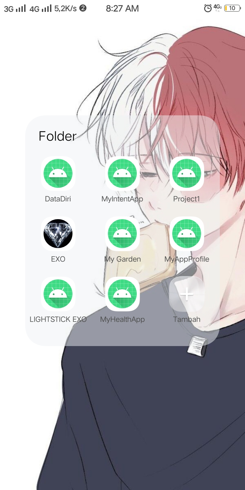
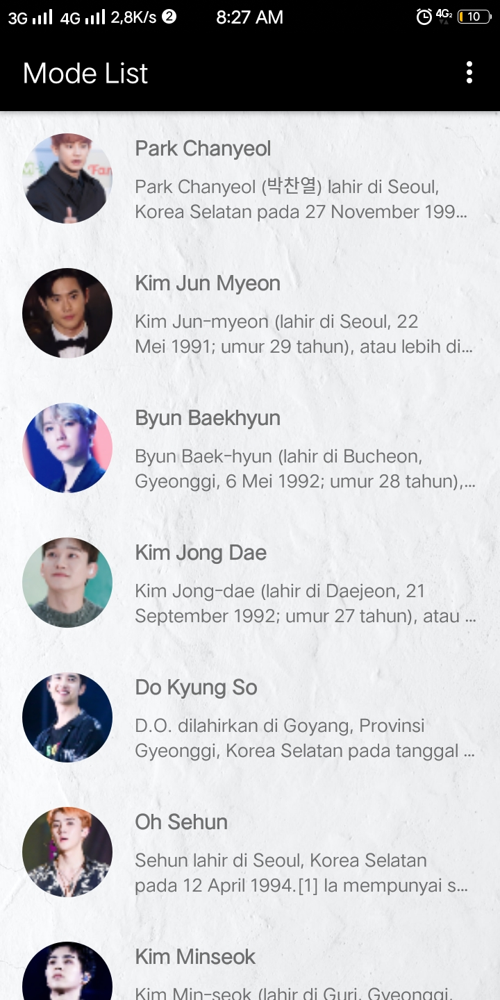
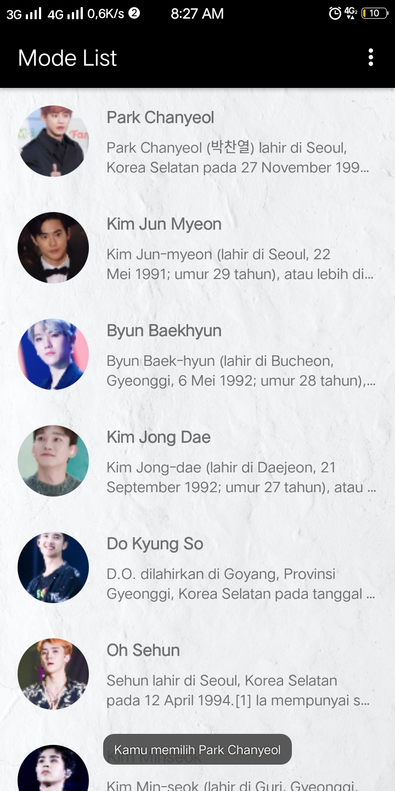
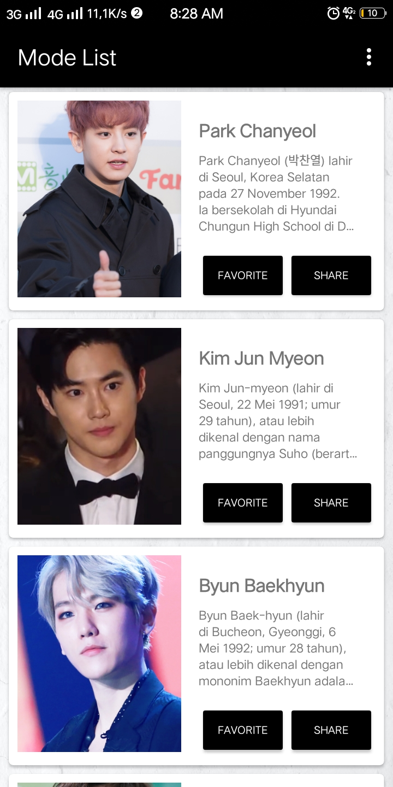
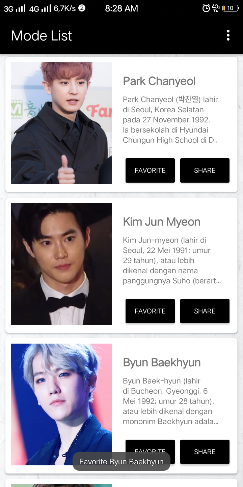

# MyRecyclerView2

RecyclerView adalah sebuah komponen tampilan (widget) yang lebih canggih ketimbang pendahulunya listview. Ia bersifat lebih fleksibel. RecyclerView memiliki kemampuan untuk menampilkan data secara efisien dalam jumlah yang besar. Terlebih jika Anda memiliki koleksi data dengan elemen yang mampu berubah-ubah sewaktu dijalankan (runtime)

<h4>Berikut Screenshot Aplikasi MyRecyclerView</h4>

 Tampilan Aplikasi 

Tampilan Mode List

Jika memilih salah satu Member akan muncul pesan

Tampilan Mode Card

Jika memilih salah satu foto Member akan muncul pesan

Tampilan Mode Card View

Jika memilih button Favorite akan muncul pesan

Jika memilih button Share akan muncul pesan

<h2>##Elshita##</h2>

